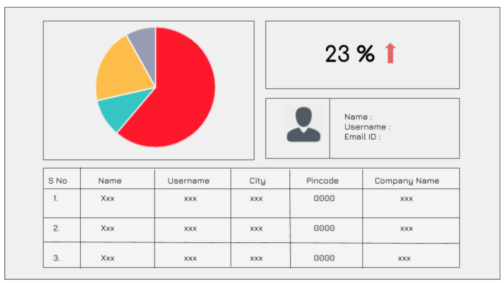

# Origa - Assignment

Origa angular assignment app

### Testing Bucket

[Start Testing](http://origa-assignment.s3-website.ap-south-1.amazonaws.com/)

### Problem Statement

Create a single page application in angular (version 4 orgreater) :

1. Use a public fake REST API  : ​https://jsonplaceholder.typicode.com/users
2. This page has been distributed in the following sections :
3. THE PIE CHART​ : The pie chart should be an actual representation of thedata fetched from the public API. It would contain different sections :
4. THE PERCENTAGE BOX​ : It should show the number of users out of 100that your public hosted API will fetch. (basically it will give out 10 users socalculate percentage accordingly )
5. THE DATA TABLE​ : Fill the data-table with the public api mentioned aboveto fetch data and filter-out only required values and populate the data-table.
  
### Assumptions ​

1. All the data should be fetched from the public API.
2. Do not put any random data inside any box.
3. ​The Page should be completely responsive (Mobile and desktop friendly).
4. Kindly host your single page application on Github.
5. Use Angular Material library for quick results.

### Note​

Solution will be judged on criteria:

1. UI/UX
2. Algorithm complexity
3. Coding practice/guideline.
4. Use of Specific Technologies mentioned in email.
5. Extra points will be awarded if you improve the current UI.
